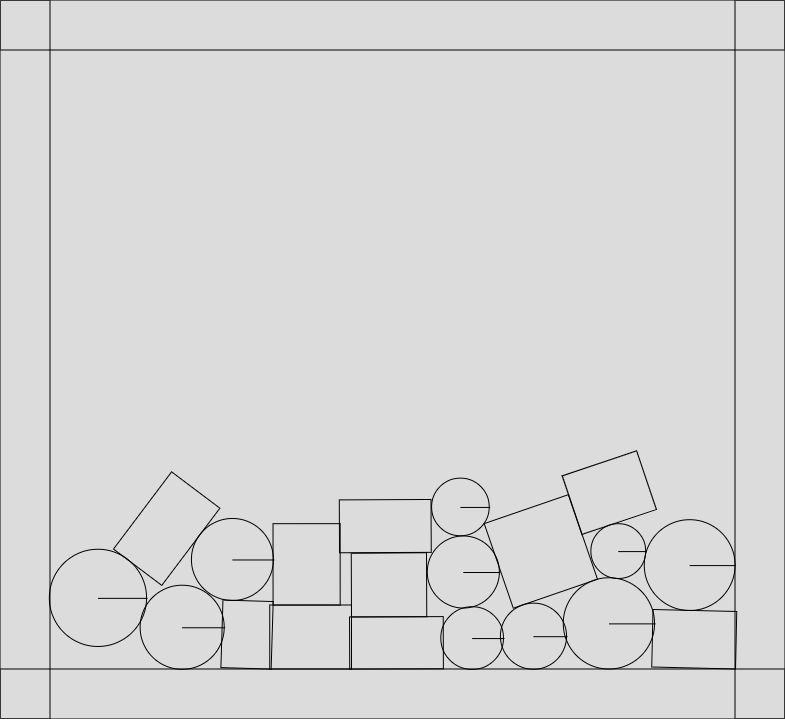

# p5physics
Basic 2D Rigid body physics engine using p5js for graphics

## Screenshot

## Demo

[Here](https://nicholaslythall.github.io/p5physics/)

## Sources

https://gamedevelopment.tutsplus.com/tutorials/how-to-create-a-custom-2d-physics-engine-the-core-engine--gamedev-7493
